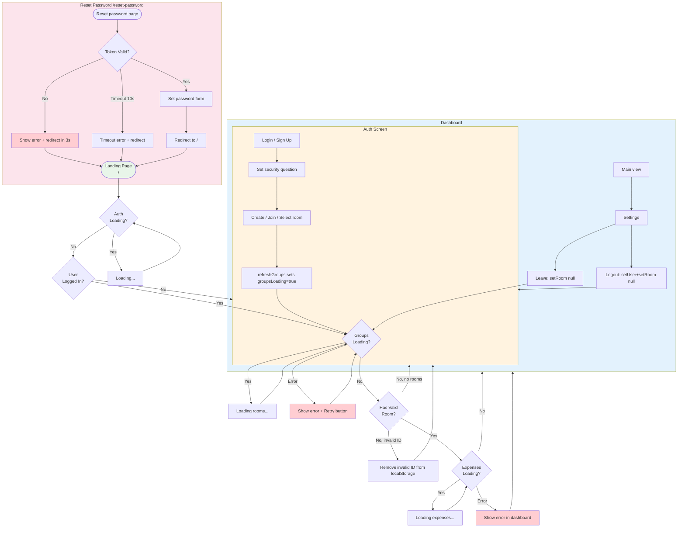

# ExpensePartner — App flow

High-level user journey derived from routing (`app/page.tsx`, `app/reset-password/page.tsx`), `MainRouter`, auth/room guards, and loading/error states in context.

## Routing summary

| Route | File | Guard / behavior |
|-------|------|-------------------|
| `/` | `app/page.tsx` | `AppProvider` → `MainRouter`: show Loading when `authLoading` or when `user && groupsLoading && !room`; else if no user or no room → `AuthScreen`; else `DashboardScreen`. |
| `/reset-password` | `app/reset-password/page.tsx` | Standalone. If session error or no session after 10s → show error and redirect to `/` in 3s. On valid session → set password form; after success redirect to `/`. |

## Auth and room guards

- **MainRouter** (in `app/page.tsx`): Shows loading when `authLoading` or when `user && groupsLoading && !room`. Renders `AuthScreen` when `!user` or `!room`; otherwise renders `DashboardScreen`. Room is required to reach the dashboard.
- **Auth state**: Restored on load via `getSession()` and kept in sync with `onAuthStateChange()` in `context/app-context.tsx`. `TOKEN_REFRESH_FAILED` and `SIGNED_OUT` clear user/room and show toast when applicable.
- **Room**: Persisted in `localStorage` (`expense_partner_last_group_id`). Restored after groups load; if stored ID is not in the user’s groups list, the key is removed (invalid ID cleanup).
- **Groups**: Initial load sets `groupsLoading`; failures set `groupsError` (shown in AuthScreen with Retry). `refreshGroups()` also clears/sets `groupsError`.
- **Expenses**: Load is cancelled when `room` changes (race-safe). Failures set `expensesError` (shown in Dashboard with Retry). `refreshExpenses()` retries for the current room.
